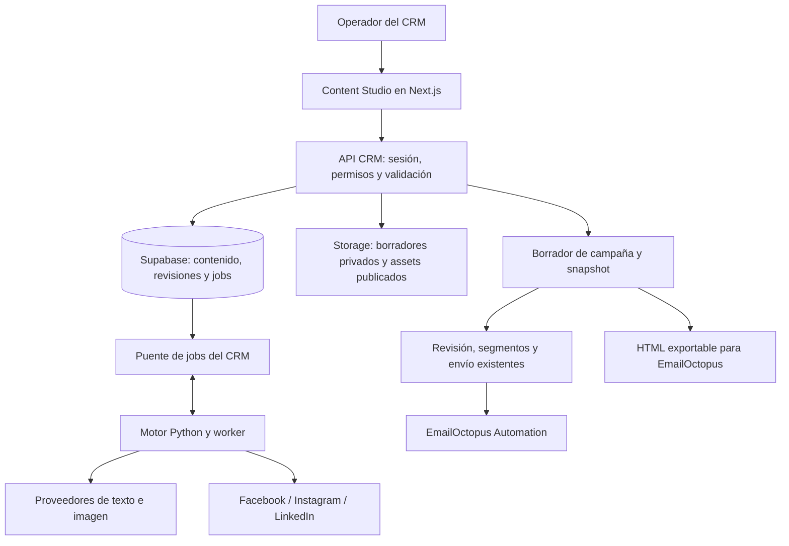

# Content Studio: redes sociales y EmailOctopus en CRM AI4L

Fecha del análisis: 29 de septiembre de 2026.
Estado (02-10-2026): fases 0 a 3A/3B implementadas y verificadas con mocks; fases 4-5 (validación con proveedores reales, piloto) pendientes de credenciales y autorización. Decisiones y contratos: `CONTENT_STUDIO_CONTRACTS.md`; operación: `CONTENT_STUDIO_OPERATIONS.md`; pendientes externos: `CONTENT_STUDIO_PROVIDER_VALIDATION.md`.

## 1. Respuesta y recomendación

**Es viable recrear el flujo de WRCC dentro del CRM y reutilizar sus textos e imágenes para email.** La solución recomendada es una pestaña Content Studio nativa del CRM, con biblioteca de contenido y versiones por canal. La publicación social y las campañas de email compartirán contenido de origen, pero conservarán destinos, aprobaciones e historiales independientes.

Para acelerar el desarrollo, recomiendo conservar los motores Python reutilizables de WRCC en un servicio de ejecución separado y adaptar sus componentes React al CRM. Supabase será la fuente de datos del nuevo módulo; la sesión y los permisos serán los del CRM. El motor no tendrá otro login ni una copia de la base de contactos.

La restricción principal está en EmailOctopus: su API v2 publicada permite iniciar una Automation para un contacto, pero no documenta creación/envío de campañas con HTML ni edición/listado de Automations. Se comprobó el documento OpenAPI actual, no solamente los comentarios del repositorio. El endpoint de queue recibe `contact_id`, no texto ni imágenes. [Especificación oficial v2](https://emailoctopus.com/api-documentation/v2).

Por eso habrá dos formas de aprovechar el contenido:

1. **Automation conectada:** una plantilla preparada en EmailOctopus utiliza campos definidos por el CRM. El nuevo editor produce los valores, imágenes y enlaces para esa plantilla. La aprobación y el envío siguen pasando por las campañas actuales. Las imágenes dinámicas y el momento de lectura de los campos necesitan una prueba técnica antes de activar esta modalidad para contenido nuevo.
2. **HTML exportable:** el Studio compone un email completo, que se importa en EmailOctopus para crear una campaña o una Automation versionada. Es una ruta viable aunque la integración dinámica no satisfaga los requisitos. EmailOctopus admite pegar el HTML completo en su editor Code your own. [Documentación oficial](https://help.emailoctopus.com/article/253-what-can-i-code-into-emailoctopus).

Si el objetivo final exige diseñar cualquier email y publicar cualquier Automation desde el CRM sin configuración externa, EmailOctopus no ofrece hoy ese contrato en la API revisada. En ese escenario se evaluaría otro proveedor mediante la abstracción de envío existente; no se promete que copiar WRCC elimine esa limitación.

## 2. Alcance auditado y decisiones pendientes

Se consultó primero codebase-memory-mcp para descubrir arquitectura y símbolos de ambos proyectos, y después se verificó la fuente local. Tres subagentes revisaron WRCC, marketing/EmailOctopus e infraestructura CRM en paralelo.

No se consultaron secretos ni cuentas productivas. No se generaron imágenes, publicaron posts, enviaron correos, ejecutaron tests o migraciones. Tener un adaptador real en el código no demuestra que una cuenta esté conectada ni que su aplicación tenga permisos productivos aprobados.

Se mantienen abiertas las preguntas sobre:

- **Interacción social:** el alcance base es generar, revisar y publicar posts como WRCC. Comentarios, respuestas y mensajes privados requieren otro módulo; WRCC no los implementa.
- **Marca:** se propone empezar con AI4L. Varias marcas del mismo equipo pueden ser perfiles; varios clientes aislados requieren diseño de tenancy antes de crear tablas y permisos.
- **Catálogo:** confirmar si AI4L necesita generación basada en cursos/servicios y cuál es la fuente autorizada. No trasladar cursos, imágenes, identidad o credenciales de WRCC a AI4L.
- **Nivel de automatización de email:** plantillas registradas y reutilizables frente a diseño libre con paso manual en EmailOctopus.

Estas preguntas se reflejan como decisiones de fase 0. El análisis y el plan continúan con las hipótesis anteriores; no se consideran respuestas confirmadas.

## 3. Qué podemos reutilizar realmente

### 3.1 WRCC Content Studio

Raíz: `C:/Projects/wrcc-content-studio`. Frontend Next 14.2.15 / React 18; backend Python, FastAPI, SQLAlchemy y Alembic.

| Capacidad | Estado comprobado | Tratamiento en AI4L |
| --- | --- | --- |
| Generación por tema, notas, referencia o curso | Implementada; tres estilos por Facebook, Instagram y LinkedIn. | Reutilizar motor y reglas; parametrizar marca, fuentes y objetivos. |
| Edición e historial | Borrador, revisión, aprobación/rechazo, duplicado, regeneración y archivo. | Adaptar componentes y separar estado editorial de estado de entrega. |
| Imágenes | Generación y upload separados; biblioteca por generación y selección ordenada por pieza. | Conservar comportamiento; usar Storage en lugar de bytes en tablas. |
| Publicación social | Adaptadores reales, OAuth, preflight, previews y enlaces de publicación. | Extraer adaptadores y pruebas; revisar permisos/versiones y reintentos. |
| Catálogo de cursos | Scraper WRCC/aXcelerate con diff y aprobación humana. | Reutilizar patrón de revisión; sustituir fuente y parsing específico si se requiere. |
| Calendario/programación | No encontrado. | Extensión posterior, con cola durable y zona horaria. |
| Comentarios/DM/inbox | No encontrado. | Investigación y desarrollo adicionales por red. |
| Analítica social | No encontrada. | Extensión por permisos y APIs disponibles. |
| EmailOctopus/email | No encontrado. | Puente nuevo hacia marketing del CRM. |

Los modos de IA y publicación del Studio arrancan en mock por defecto. El nuevo entorno debe distinguir explícitamente simulación y producción.

**Fuente concreta a reutilizar/adaptar:**

| Función | Archivos dentro de WRCC |
| --- | --- |
| Pantallas | `frontend/app/(app)/generate/page.tsx`, `history/page.tsx`, `settings/page.tsx` |
| Edición/media | `frontend/components/content/VariantCard.tsx`, `MediaPanel.tsx` |
| Previews/publicación | `frontend/components/content/PostPreview.tsx`, `PublishDialog.tsx` |
| Contratos frontend | `frontend/types/content.ts`, `types/publishing.ts`, `lib/postText.ts`, `lib/publishing.ts` |
| Generación | `backend/app/agents/content_generator.py`, `validation.py`, `llm/client.py`, `llm/images.py` |
| Workflow | `backend/app/content/service.py`, `schemas.py`, `state.py` |
| Tratamiento de imágenes | `backend/app/content/ingest.py`, `media.py` |
| Proveedores sociales | `backend/app/publishing/publishers/{base,facebook,instagram,linkedin,mock}.py`, `meta_graph.py` |
| OAuth | `backend/app/publishing/oauth/{base,meta,linkedin,mock}.py` |
| Reglas de publicación | `backend/app/publishing/rules.py`, `state.py`, `schemas.py`, `service.py` |
| Casos compartidos | `shared/post-text-cases.json` |

No copiar literalmente autenticación WRCC, repositorios SQLAlchemy, migraciones Alembic, versiones Next/React, estilos globales ni configuración de marca. Los adaptadores de publicación ya reciben contratos pequeños, como `PublishRequest` y `PublishResult`, lo que facilita extraerlos sin trasladar toda la aplicación.

### 3.2 CRM AI4L

| Base existente | Uso en la solución |
| --- | --- |
| Next 16.3.6, React 19, Sidebar y vistas | Montar un módulo independiente dentro de `?view=content-studio`. |
| Sesión Supabase y membresía activa | Mantener una sola identidad y autorización. |
| Campaigns, segmentos y streams | Crear borradores de email y reutilizar selección de audiencia y consentimiento. |
| Registro de plantillas | Ampliarlo a contratos versionados con texto, URL e imagen. |
| Aprobación ligada a revisión | Extenderla a cambios de imagen, plantilla y contenido derivado del Studio. |
| `campaign_runs` / `campaign_sends` | Reutilizar preparación de audiencia, claims, resultados e incertidumbre. |
| Jobs existentes | Reutilizar patrones de leases y recuperación; separar el presupuesto de generación visual. |
| Storage/biblioteca de assets | No existe implementación reutilizable encontrada; construirla. |

Importante: el registro tiene `TemplateSlot`, pero generación, edición y validación usan todavía siete campos fijos (`Headline`, `Preheader`, `Intro`, `Benefit1–3`, `CtaLabel`). Añadir `HeroImageUrl` a una lista de slots no completa el cambio.

## 4. Experiencia propuesta

La navegación principal incorpora **Content Studio**. Dentro del módulo:

- **Crear:** tema, público, objetivo, referencia, notas, marca y canales.
- **Biblioteca:** piezas e imágenes, con búsqueda, estado y canal.
- **Revisión:** variantes pendientes y acciones de aprobar/rechazar.
- **Publicaciones:** resultados por cuenta/canal, errores y enlaces externos.
- **Conexiones:** acceso al área de Settings para conectar cuentas y ver su estado.

El email aparece como otro uso del contenido mediante **Crear email**, abriendo una composición específica y después el flujo de campañas. Se puede crear email sin haber publicado el post.

### Recorrido completo

1. El operador escribe un brief o elige información de un servicio/curso autorizado.
2. Selecciona Facebook, Instagram, LinkedIn y/o email.
3. Se genera texto por canal. Las imágenes se generan o cargan mediante acciones separadas.
4. El operador selecciona variantes, corrige hechos, edita el texto y ordena imágenes.
5. Cada variante se revisa y aprueba de forma independiente.
6. Para redes, elige una cuenta conectada, ve el preview/preflight y confirma publicación.
7. Para email, elige layout, asunto, preheader, imagen, texto y CTA; elige plantilla/Automation y segmento.
8. Crear email produce una campaña `draft`. Aprobar un post no autoriza enviar un correo.
9. Campaigns gestiona aprobación y envío existentes. El Studio muestra el vínculo y el estado derivado.
10. Una edición posterior crea otra revisión; no modifica un post publicado ni un email ya aprobado/enviado.

El editor de email inicial será de bloques limitados: cabecera, imagen principal, párrafos, lista breve, CTA y footer. Un editor libre tipo Canva o un constructor HTML arbitrario es otro alcance.

## 5. Arquitectura recomendada



### Por qué esta opción

| Opción | Ventaja | Coste/limitación | Decisión |
| --- | --- | --- | --- |
| Iframe o enlace a WRCC | Acceso rápido al sitio existente. | Mantiene login/datos separados y no resuelve contenido-email. | No usar como integración final. |
| Port completo a TypeScript | Un solo lenguaje para lógica nueva. | Reescribir y verificar adaptadores Python, OAuth y procesamiento de imágenes. | Alternativa si no se acepta operar Python. |
| UI nativa + motor Python extraído | Conserva motores y pruebas, con UX y permisos del CRM. | Requiere un servicio/worker adicional y contrato entre servicios. | Recomendado para reducir reescritura. |

La extracción será una copia versionada dentro de este repositorio, con procedencia documentada. No importar código en runtime desde `C:/Projects/wrcc-content-studio` ni llamar al entorno productivo WRCC. No crear un paquete compartido entre proyectos hasta comprobar que realmente se necesita mantener ambos en paralelo.

### Responsabilidades

**CRM:** identidad, membresía, datos, revisión, permisos de publicar, cola persistente, metadatos/Storage, catálogo de conexiones, campañas y EmailOctopus.

**Motor Python:** generación, validación específica de red, normalización de imágenes, intercambios OAuth y llamadas a proveedores sociales. Recibe trabajo autorizado y devuelve resultados tipados. No decide qué contactos reciben email.

**Despliegue:** Next mantiene su entorno actual. El motor necesita un runtime Python con proceso worker persistente, healthcheck y reinicio. Elegir hosting en fase 0 según infraestructura disponible; el código no debe depender de una plataforma concreta. No ejecutar procesos Python largos dentro de una petición de Next ni esperar al cron diario actual.

### Contrato entre servicios

- API interna versionada `/v1`, DTOs JSON y fixtures compartidos; Pydantic en Python y validadores TypeScript en CRM.
- El navegador solo habla con el CRM. Operaciones rápidas como el intercambio OAuth pasan por servidor a servidor.
- Para trabajo largo, la API crea un job y responde `202` con `jobId`. El worker obtiene jobs mediante endpoints internos autenticados del CRM.
- Endpoints internos concretos: claim, heartbeat, contexto de ejecución, checkpoint, begin-dispatch, complete y fail. Cada mutación exige token de lease, job esperado y resultado compatible; el worker no recibe un endpoint genérico para modificar tablas. Checkpoint persiste IDs intermedios; begin-dispatch registra el inicio del efecto externo antes de llamar al proveedor y revalida aprobación, destino y revisión.
- Credenciales de servicio independientes de las sesiones y de `CRON_SECRET`, rotables y solo servidor; TLS, logs sin tokens y protección de replay para peticiones firmadas.
- Actor, marca y destino se derivan del registro autorizado del job. No se confían valores arbitrarios del navegador.
- El CRM conserva credenciales sociales cifradas en almacenamiento no legible por roles del navegador. Solo entrega al worker el token requerido por un job autorizado; no incluye tokens en la cola persistida ni en sus resultados.
- Callbacks OAuth vuelven al CRM, comprueban state de un solo uso, sesión y permiso. El motor realiza el intercambio acotado y devuelve secretos únicamente al servidor CRM.

## 6. Modelo de datos

Nombres propuestos; se fijarán antes de implementar. Migraciones nuevas posteriores a las existentes, sin reescribir las de campañas actuales.

| Tabla | Responsabilidad y datos importantes |
| --- | --- |
| `content_brand_profiles` | Nombre, tono, hechos aprobados, logo/referencias y reglas de CTA. AI4L inicialmente. |
| `content_items` | Pieza/brief de origen, creador, marca, título, revisión y archivo. |
| `content_variants` | Canal, formato y puntero a revisión vigente; varias opciones por canal. |
| `content_variant_revisions` | Texto estructurado, hechos/fuentes, versión de prompt, asset IDs ordenados y checksum. Inmutable. |
| `content_reviews` | Revisión aprobada/rechazada, actor y motivo. |
| `content_assets` | Storage path, MIME real, tamaño, dimensiones, checksum, origen, alt y estado de ingestión/publicación. |
| `content_jobs` | Tipo, snapshot de entrada, idempotencia, estado, lease, reintentos, solicitud proveedor, resultado y coste/uso disponible. |
| `social_accounts` | Marca, plataforma, ID externo, nombre, permisos y salud; varias cuentas explícitas si se necesitan. |
| `social_account_secrets` | Tokens cifrados, vencimiento y versión de clave; acceso exclusivo servidor. |
| `social_publications` | Cuenta + revisión + intento, estado, IDs intermedios, ID externo, permalink y resultado incierto. |
| `campaign_content_snapshots` | Versión fuente, contrato de plantilla, copy, assets, CTA y HTML/texto cuando corresponda. |
| `content_audit_events` | Quién generó, editó, aprobó, convirtió, publicó o cambió una conexión. |

Reutilizar `campaigns`, `campaign_templates`, `campaign_runs` y `campaign_sends`. Las campañas referencian snapshots y los runs conservan el snapshot utilizado. No construir un segundo ledger de email en el Studio.

### Reglas de integridad

1. Publicación social pertenece a una revisión y una cuenta, no al estado global de la pieza.
2. Aprobar una revisión no aprueba revisiones posteriores ni otros canales.
3. Crear un email copia contenido; editar la fuente después no cambia la campaña.
4. Toda modificación que afecte al email invalida su aprobación: texto, imagen, alt, enlaces, contrato, plantilla y CTA.
5. Idempotencia en creación de jobs, conversión a campaña y solicitud de publicación; evitar dobles clics y repeticiones por timeout.
6. Un resultado de generación sobre una revisión vieja se guarda como variante nueva o conflicto; nunca pisa una edición posterior.
7. Assets utilizados por publicaciones/campañas tienen retención y no se eliminan al archivar una pieza.
8. Añadir RLS explícita a todas las tablas nuevas. La migración actual de membresía recorrió tablas existentes; no protege automáticamente las creadas después. Las políticas de `storage.objects` requieren trabajo separado.
9. La tabla `organisations` del CRM representa empresas de contactos, no clientes aislados del software. No usar `organisation_id` como tenant por conveniencia.

Si se confirma multi-cliente, añadir workspace, membresías por workspace y aislamiento en contenido, cuentas, jobs, secretos, Storage y vínculo con campañas/contactos antes de implementar. Un `brand_id` por sí solo no aporta ese aislamiento.

## 7. Imágenes y biblioteca compartida

WRCC guarda imágenes como binarios en base de datos y genera URLs públicas firmadas temporales. El código configura 1.800 segundos; el README menciona otro valor. Ninguna de esas URLs sirve como referencia durable de un email.

Implementación propuesta:

1. Subida autorizada a cuarentena privada en Supabase Storage, con límites de bytes y formatos.
2. Worker comprueba el archivo real, decodifica, elimina metadatos, limita dimensiones y vuelve a codificar. Reutilizar reglas de `ingest.py` y sus pruebas.
3. Registrar checksum y metadata; generar variantes de tamaño/formato por destino sin alterar el original.
4. Biblioteca privada con previews firmados para miembros del CRM.
5. Al preparar una publicación/email, crear una copia publicable con path inmutable. Para email, URL HTTPS estable sin expiración de minutos y con política de retención.
6. Permitir lectura pública de esos assets publicados, no listar ni exponer borradores. No incorporar nombres/emails de contactos al path ni al archivo.
7. Conservar alt text y orden de selección por revisión. Un carrusel social se adapta a imagen principal/bloques para email.
8. Preflight verifica disponibilidad del asset y su pertenencia a la revisión aprobada. Las referencias a Storage deben ser IDs/path controlados, no URLs remotas arbitrarias.

No enviar `blob:`, localhost, imágenes en base64 incrustadas ni screenshots de todo el email. El texto principal debe seguir siendo texto, y el correo debe entenderse con imágenes bloqueadas.

## 8. EmailOctopus: diseño y límites que debemos resolver primero

### 8.1 Prueba técnica inicial obligatoria para cerrar el diseño

En entorno de prueba y con destinatarios controlados, validar:

| Prueba | Resultado que debe quedar documentado |
| --- | --- |
| Campos en cuerpo | Valores, caracteres especiales, saltos de línea, límites reales y escaping. |
| Imagen dinámica | Si un campo puede usarse en `src` y otro en `alt`, y cómo lo conserva el editor/renderer. |
| Asunto | Si el asunto de la Automation puede depender del campo propuesto; el `subject` del CRM actual no se envía en queue. |
| Momento de lectura | Cuándo se materializan campos: al entrar, al alcanzar el paso de email o después. |
| Concurrencia | Dos campañas con el mismo contacto, contenido distinto y retrasos deliberados. |
| Repetición | Comportamiento con Allow contacts to repeat, contactos en ejecución y reintentos. |
| Plantilla | Qué puede verificarse por API y qué necesita checklist/prueba manual. |
| Cuenta | Cuota de campos/Automations y capacidades del plan real. |
| Rendering | Gmail, Outlook, Apple Mail, móvil y carga tardía de imágenes. |

Esta fase no incluye mandar pruebas ahora. Las pruebas reales se harán durante implementación con una lista de pruebas y autorización correspondiente. Una prueba satisfactoria ayuda a detectar fallos, pero no sustituye una garantía del proveedor sobre cuándo se leen campos bajo concurrencia.

### 8.2 Riesgo real: campos compartidos por contacto

El CRM actual ejecuta `setContactFields()` y después `triggerSend()`. El claim protege una fila de `campaign_sends`, pero dos campañas distintas pueden escribir los mismos campos del mismo contacto.

Un snapshot local conserva lo aprobado en CRM; no obliga a EmailOctopus a usar ese snapshot. Tampoco basta un mutex que se libera cuando queue responde: el email puede renderizarse más tarde, especialmente en Automations con Wait.

**Regla de salida:** no habilitar nuevas campañas dinámicas de Studio hasta documentar una estrategia que preserve el contenido por entrega. Opciones:

- Si el proveedor garantiza el punto de captura, serializar escrituras por lista/contacto hasta ese punto y probar carreras. El bloqueo debe cubrir también otras rutas que puedan modificar campos de campaña.
- Para secuencias con esperas o sin garantía de captura, usar contenido estático en una Automation versionada, creada/configurada en EmailOctopus. El CRM puede activarla, pero no sobrescribe textos/imágenes comunes por contacto para transportarlos.
- Exportar HTML para campañas gestionadas en EmailOctopus cuando el diseño cambia cada vez. El CRM registra la exportación como tal, no como envío confirmado.
- Si se requiere contenido arbitrario, concurrencia y cero configuración manual, evaluar proveedor que acepte un payload inmutable por envío/campaña.

Campos con prefijos por plantilla reducen colisiones entre plantillas, pero no resuelven por sí solos repeticiones de la misma plantilla ni esperas. Un timeout fijo tampoco prueba que el proveedor haya terminado de leer.

**Precisión del fallback estático:** también debe evitar enlaces variables por campaña/contacto. `BookingUrl` sigue siendo mutable aunque el texto y las imágenes sean estáticos. La primera versión de ese fallback usará CTA estático externo o ninguno; booking exige resolver la misma garantía de captura. Mantener actualizados los campos permanentes de preferencias y consentimiento no equivale a transportar contenido distinto por campaña.

### 8.3 Plantillas versionadas y composición

Crear un contrato versionado, por ejemplo `studio-newsletter-v1`, con campos tipados `text`, `url`, `image`, límites, obligatoriedad y comportamiento de CTA. Reutilizar el contrato antiguo de siete campos para campañas existentes.

Campos candidatos del contrato nuevo: asunto si se verifica su uso remoto, preheader, headline, introducción, cuerpo breve, imagen principal, alt, CTA label y URL. No añadirlos indiscriminadamente a todas las listas. Campos de preferencias y consentimiento siguen reservados.

Generación, validación, formulario, renderer y preflight leerán el mismo contrato. El modelo genera datos estructurados, no HTML libre que se inserta sin control.

El renderer produce HTML de email y texto plano: layout simple, tablas cuando corresponda, estilos inline, enlaces HTTPS validados, tamaños de imagen explícitos y footer. El preview del CRM representa ese render local; no se presentará como captura garantizada de la Automation remota. [Recomendaciones oficiales de HTML de EmailOctopus](https://help.emailoctopus.com/article/253-what-can-i-code-into-emailoctopus).

### 8.4 CTA general y compatibilidad con reservas

La generación actual está orientada a consultas y `BookingUrl`. Una noticia o promoción social no debe convertirse automáticamente en una reserva.

Agregar a la plantilla un modo de CTA:

- `booking`: conserva creación de enlaces/flujo existente.
- `external_url`: usa un destino aprobado del contenido.
- `none`: no necesita enlace de reserva.

El sender solo crea booking cuando el contrato lo exige. Revisar `send.ts`, preflight, prompts y campos reservados. `BookingUrl` permanece reservado en todos los modos: external_url utiliza otro slot validado y congelado; none no genera reservas. Evitar que una plantilla general lea un BookingUrl residual de una campaña anterior. `PrefsUrl`, `Newsletter` y `Courses` siguen bajo control del sistema.

### 8.5 Crear campaña y mantener la evidencia

1. `Crear email` identifica una revisión fuente y assets exactos.
2. Adaptar texto: retirar hashtags y referencias como link in bio, redactar asunto/preheader y mantener hechos comprobables.
3. Seleccionar layout/contrato, segmento y stream derivado de plantilla.
4. Guardar snapshot y campaña draft en una operación idempotente y transaccional.
5. Abrir Campaigns en esa campaña concreta mediante navegación del CRM.
6. Reutilizar aprobación, preparación de audiencia, consentimiento al despachar y manejo de resultados inciertos.
7. Guardar por run el snapshot de contenido y plantilla utilizado; una nueva ejecución no borra la evidencia anterior.

**Campañas fallidas con envío parcial:** hoy cambiar audiencia crea otra ejecución, pero cambiar únicamente copy no asegura ese comportamiento. Al introducir snapshots, una edición de contenido después de aceptaciones del proveedor deberá crear una nueva campaña o ejecución explícita y volver a aprobación. Mostrar los destinatarios ya aceptados y decidir conscientemente si se excluyen o se reenvía; nunca mezclar dos versiones de contenido dentro de un run ni reiniciar el envío a todos silenciosamente. Probar fallo parcial → edición de imagen/copy → nueva aprobación → audiencia de reanudación.

Las Automations remotas se versionarán operativamente: una versión usada por campañas aprobadas no se edita en sitio. Registrar automation ID, versión, fecha de prueba y HTML de referencia. La API examinada no permite demostrar automáticamente que nadie cambió el HTML remoto; reflejar esa limitación en preflight y documentación.

El estado de queue significa aceptación, no entrega, apertura o clic. Mantener esa distinción y no inventar métricas de Automations a partir de endpoints de informes de campañas.

## 9. Publicación social

### Conexión y permisos

Portar Meta y LinkedIn por separado, con state OAuth de un solo uso, callbacks registrados, selección de cuenta y tokens cifrados. Admin conecta/desconecta/configura; proponer permisos editoriales para operadores y aprobación/publicación según matriz acordada.

No usar automáticamente un perfil personal como fallback de una página empresarial: es otro destino y requiere selección explícita. Revisar expiración/revocación, reautenticación y permisos antes de cada publicación.

WRCC configura versiones Meta `v23.0` y LinkedIn `202506`; deben revalidarse antes de copiarlas. LinkedIn documenta permisos distintos por miembro/organización y exige versión de API en las peticiones. [Posts API oficial](https://learn.microsoft.com/en-us/linkedin/marketing/community-management/shares/posts-api).

No se logró recuperar la documentación Meta con la herramienta web por restricciones/429. Los flujos Meta descritos aquí se verificaron en el código WRCC; compatibilidad y permisos vigentes quedan como comprobación explícita de fase 0, no como validación ya realizada.

### Ejecución durable

1. Confirmación humana crea intención de publicación vinculada a revisión, cuenta y assets aprobados.
2. Worker reclama con lease y vuelve a comprobar aprobación y estado de la conexión.
3. Preparar/subir media, persistiendo IDs de pasos intermedios cuando sirvan para reanudar.
4. Registrar que comienza la llamada con efecto público antes de ejecutarla.
5. Guardar resultado, ID y permalink.
6. Si el resultado es incierto, detener reintento automático y mostrar una acción de revisión/reconciliación.

La recuperación distingue el punto alcanzado: un lease expirado antes de begin-dispatch puede volver a cola; después de begin-dispatch pasa a uncertain hasta reconciliar. Un worker con lease antiguo no puede completar ni ejecutar una publicación nueva. Si la base rechaza begin-dispatch, no se llama al proveedor.

No prometer exactamente una publicación externa por un índice local. El código WRCC de Facebook de 0/1 imagen envuelve la publicación en un helper de reintentos; revisar su clasificación antes de reutilizarlo. Separar preparación repetible de creación pública, como hacen otros caminos del Studio.

### Orden de entrega

Implementar y validar Facebook, Instagram y LinkedIn como adaptadores independientes. Activar cada uno al superar pruebas y disponibilidad de permisos; la aprobación externa de una red no debe bloquear generación, biblioteca o email.

La paridad base incluye texto/fotos de Facebook, imagen/carrusel Instagram y posts/multimagen LinkedIn según capacidades autorizadas. Programación, vídeo, reels, stories, analítica e inbox tendrán fases propias si se confirman.

## 10. Jobs, seguridad y operación

El cron CRM actual es diario y prioriza consentimiento, pagos y campañas; no es una cola genérica para imágenes. El motor de contenido tendrá ejecución pronta y durable, separada de esas prioridades.

Estados propuestos de job: `queued`, `running`, `succeeded`, `failed`, `cancelled`, `uncertain`. Usar heartbeat, lease, intentos acotados, backoff y límites por proveedor. Una generación puede dejar resultados parciales por canal y permitir repetir solo lo fallido.

- Cerrar el navegador no cancela ni pierde el trabajo. Al volver, la UI consulta estado persistido.
- Cancelar evita nuevas etapas; no promete deshacer una publicación ya aceptada ni recuperar costes de generación.
- No repetir a ciegas una petición de generación costosa cuyo resultado se desconoce. Registrar request ID y recuperar si el proveedor lo permite.
- El procesamiento de una URL de referencia debe validar protocolo, DNS, direcciones privadas, redirects, tamaño y tiempo. WRCC descarga con redirects y recorta texto después; no copiar ese comportamiento sin límites de red.
- Referencias web y texto de archivos son datos no confiables para el modelo; no pueden cambiar permisos ni instruir publicación/envío.
- Aplicar presupuestos de generación, concurrencia y tamaño de archivo por entorno/operador. Registrar modelo, prompt version, uso y coste estimado cuando esté disponible; no mostrar una tarifa inventada.
- Añadir alertas de jobs estancados, cuenta desconectada y publicación incierta al panel Operations.

Los endpoints internos del worker necesitan clasificación exacta en `src/lib/auth/routes.ts` y paso específico en `src/proxy.ts`, con autenticación propia en cada handler. No agregar un prefijo público genérico para toda la API de contenido. Los endpoints de usuario siguen usando membresía/RLS.

## 11. Archivos del CRM a modificar

| Grupo | Archivos existentes | Cambio |
| --- | --- | --- |
| Navegación | `src/components/Sidebar.tsx`, `src/app/page.tsx` | Tab, montaje de módulo y abrir campaña derivada. CSS de Sidebar solo si hace falta. |
| Tipos/persistencia | `src/lib/db/types.ts`, nuevas migraciones y verificaciones SQL | Tablas, contratos, snapshots, claims y RLS. |
| Plantillas | `src/lib/marketing/templates.ts`, `mergeFields.ts` | Contrato versionado y validación común; compatibilidad de siete campos. |
| Generación email | `src/lib/marketing/generateCampaign.ts`, `generateForCampaign.ts`, `prompt.ts` | Usar contrato y objetivo de plantilla; separar contenido general de booking. |
| Editor/registro | `src/components/marketing/CampaignCopyEditor.tsx`, `EmailTemplateRegistry.tsx`, `MarketingView.tsx` | Slots nuevos, imágenes, CTA, enlaces al Studio y campaña seleccionada. |
| API campañas | `src/app/api/campaigns/route.ts`, `[id]/route.ts`, `[id]/approve/route.ts`, `[id]/preflight/route.ts` | Creación compartida, validación de snapshot y requisitos nuevos. |
| API plantillas/campos | `src/app/api/templates/route.ts`, `[id]/route.ts`, `src/app/api/integrations/emailoctopus/fields/route.ts` | Registro de contratos y preflight de campos según plantilla. Verificar detalle de handlers al implementar. |
| Entrega | `src/lib/marketing/send.ts`, `dispatch.ts`, `runs.ts`, `providers/types.ts`, `providers/emailOctopus.ts` | Snapshot por run, CTA, campos aprobados y estrategia de concurrencia verificada. |
| Auth interna | `src/lib/auth/routes.ts`, `src/proxy.ts` y pruebas | Worker autenticado y allowlist exacta; mantener APIs normales privadas. |
| Operaciones | `src/lib/operations/attention.ts`, `types.ts`, `src/components/operations/OperationsPanel.tsx` | Fallos/leases de contenido y conexiones. |
| Recuperación | `src/lib/jobs/runJobs.ts`, `src/app/api/cron/jobs/route.ts` | Solo recuperación acotada si procede; generación fuera de este presupuesto. |
| Configuración | `.env.local.example`, `.github/workflows/ci.yml`, `playwright.config.ts`, scripts de preflight/verificación | Nuevas variables sin valores secretos, tests Python, worker y E2E. |
| Documentación | `docs/DEPLOYMENT.md`, `ACCESS_CONTROL.md`, `EMAILOCTOPUS_SETUP.md`, `CAMPAIGN_DELIVERY.md` | Contratos, operación, límites y rollout. |

No hay que cambiar todo el módulo de marketing a la vez: primero introducir contratos/snapshots compatibles, después añadir el nuevo layout.

## 12. Archivos nuevos propuestos

```text
src/components/content-studio/
  ContentStudioView.tsx
  BriefForm.tsx
  VariantCard.tsx
  VariantEditor.tsx
  AssetLibrary.tsx
  GenerationProgress.tsx
  SocialPreview.tsx
  PublishDialog.tsx
  CreateEmailDialog.tsx
  EmailPreview.tsx
  PublicationHistory.tsx
  ContentStudio.module.css

src/components/settings/
  SocialConnectionsSettings.tsx
  BrandProfileSettings.tsx

src/lib/content-studio/
  types.ts
  validation.ts
  repository.ts
  revisions.ts
  approvals.ts
  jobs.ts
  workerClient.ts
  workerAuth.ts
  assets.ts
  audit.ts
  toEmailCampaign.ts
  emailRenderer.ts

src/lib/social/
  accounts.ts
  credentials.ts
  oauthState.ts
  publications.ts
  preflight.ts

src/lib/marketing/
  createCampaign.ts
  templateContracts.ts
  contentSnapshots.ts

src/app/api/content-studio/
  items/route.ts
  items/[id]/route.ts
  items/[id]/generate/route.ts
  variants/[id]/review/route.ts
  variants/[id]/email-draft/route.ts
  variants/[id]/export/route.ts
  jobs/[id]/route.ts
  assets/route.ts

src/app/api/social/
  accounts/route.ts
  oauth/[provider]/start/route.ts
  oauth/[provider]/callback/route.ts
  publications/route.ts
  publications/[id]/route.ts

src/app/api/internal/content-worker/
  claim/route.ts
  heartbeat/route.ts
  context/route.ts
  checkpoint/route.ts
  begin-dispatch/route.ts
  complete/route.ts
  fail/route.ts

services/content-engine/
  pyproject.toml
  Dockerfile
  app/main.py
  app/contracts.py
  app/config.py
  app/worker.py
  app/crm_client.py
  app/generation/
  app/media/
  app/social/oauth/
  app/social/publishers/
  tests/

shared/content-contracts/
  schemas/
  fixtures/

src/e2e/content-studio.spec.ts
docs/CONTENT_STUDIO_OPERATIONS.md
docs/CONTENT_STUDIO_PROVIDER_VALIDATION.md
```

Cada servicio/ruta/componente con lógica tendrá pruebas cercanas siguiendo convenciones existentes. Los nombres son propuesta de destino, no afirmación de que esos archivos ya existan. La configuración concreta del hosting del motor se agregará después de elegir entorno.

## 13. Implementación paso a paso

### Fase 0. Contratos y pruebas de viabilidad

1. Registrar la base de trabajo actual y coordinar con el plan previo de tags/Job Types; hay cambios locales amplios que conservar.
2. Cerrar alcance de marca, cuentas, interacción social, catálogo y layouts de email.
3. Extraer una muestra de un publisher y un generador Python con mocks, sin dependencias de repositorios/auth WRCC. Medir el trabajo real de extracción.
4. Ejecutar la matriz técnica de EmailOctopus en entorno de prueba cuando esté habilitado. Documentar qué se puede automatizar y qué requiere plantilla estática/exportación.
5. Verificar permisos/aplicaciones de redes y versiones soportadas. Registrar bloqueos externos por plataforma.
6. Elegir hosting/runtime del motor y política de acceso entre servicios.
7. Fijar DTOs, estados, revisión/idempotencia, slots de email y propiedad de archivos entre agentes.

**Salida:** decisión de arquitectura confirmada, contratos compartidos y documento de límites reales. La falta de aprobación de una red no impide continuar con mocks ni con biblioteca/email.

### Fase 1. Base de datos, Storage y módulo vacío integrado

1. Crear migraciones aditivas para contenido, revisiones, jobs, cuentas y snapshots.
2. Implementar RLS, acceso de Storage y restricciones de funciones internas.
3. Crear biblioteca privada y flujo de ingestión normalizada.
4. Montar tab y estados vacíos/carga/error; no extender el monolito de `page.tsx` con lógica editorial.
5. Implementar worker claim/heartbeat/complete con mocks y observabilidad.

**Salida:** crear/editar una pieza, subir una imagen y recuperar un job después de cerrar el navegador, con permisos probados.

### Fase 2. Generación y workflow editorial

1. Parametrizar prompts WRCC para AI4L y hechos autorizados.
2. Adaptar generación por canal y tres estilos, resultados parciales y validación de longitud/formato.
3. Integrar generación de imágenes y upload como acciones separadas.
4. Añadir editor, regeneración, historial, duplicado, archivo y aprobación por revisión.
5. Adaptar previews de red y exportación de texto/assets.
6. Habilitar proveedor real para equipo de prueba con límites de uso; conservar fixtures mock para CI.

**Salida:** paridad del flujo editorial de WRCC por tema libre dentro del CRM, sin depender de cuentas sociales para generar y revisar contenido. La generación desde catálogo se entrega según la decisión de fuente descrita en sección 16.

### Fase 3A. Publicación social, paralela a 3B

1. Conexiones OAuth y cifrado de tokens.
2. Preflight por red/cuenta/assets y chequeo de aprobación vigente.
3. Portar publishers con recuperación y estados inciertos; corregir frontera de reintentos de Facebook.
4. Integrar worker durable, resultados, permalink y auditoría.
5. Probar cada red en cuenta de pruebas y activar solo adaptadores validados.

**Salida:** generar → aprobar → publicar → consultar resultado por destino, sin duplicar por reintentos locales.

### Fase 3B. Email reutilizando el contenido, paralela a 3A

1. Introducir contratos de plantilla versionados y mantener campañas antiguas.
2. Implementar adaptación de texto social a email y composición de bloques.
3. Añadir renderer HTML/texto, previews y assets estables.
4. Extraer creación de campaña a servicio compartido e implementar conversión idempotente a draft.
5. Extender editor/validadores/preflight/approval/sender para snapshot y CTA según plantilla.
6. Implementar el modo EmailOctopus validado en fase 0. Si es plantilla estática, documentar creación/importación y registro; si es dinámica, aplicar la estrategia de concurrencia comprobada.
7. Probar una Automation real en lista controlada y conservar el email recibido como evidencia del layout.

**Salida:** una pieza del Studio produce un email revisable con imágenes; se exporta o se activa mediante Automation registrada según el modo elegido. No presentar la exportación como automatización completa.

### Fase 4. Integración y regresión

1. Recorrer un mismo contenido hacia las tres redes y una campaña, verificando independencia de revisiones y resultados.
2. Probar errores de proveedor, desconexiones, leases, duplicados y retirada de consentimiento.
3. Verificar políticas con usuario no aprobado/deshabilitado y acceso directo a Storage/RPC.
4. Revisar móvil, teclado, foco, mensajes de progreso y preview con imágenes bloqueadas.
5. Medir cola, latencia y costes con concurrencia limitada; confirmar que jobs de contenido no frenan consentimiento/pagos.
6. Completar documentación de mantenimiento, rotación de credenciales y resolución de resultados inciertos.

### Fase 5. Piloto y publicación

1. Aplicar migraciones compatibles y configurar Storage/motor en staging.
2. Desplegar con flags independientes para Studio, generación real, cada red y puente email.
3. Activar para un equipo piloto, conectar cuentas autorizadas y verificar destinos visibles.
4. Publicar/enviar pruebas controladas, revisar resultados y activar gradualmente.
5. Monitorizar fallos, costes, trabajos en cola y desconexiones.

Rollback: desactivar nuevas solicitudes/publicaciones, conservar snapshots/assets/ledger y resolver trabajos en vuelo. Ocultar un tab por sí solo no detiene un worker. No borrar tablas ni imágenes usadas por emails ya enviados.

## 14. Reparto entre subagentes para ahorrar tiempo

Capacidad: coordinador + tres subagentes. Reutilizar agentes entre tandas; no abrir cinco frentes concurrentes ni permitir ediciones simultáneas del mismo archivo.

### Tanda A: investigación técnica y contratos

| Responsable | Trabajo paralelo |
| --- | --- |
| Coordinador | Alcance, arquitectura, contratos y decisiones de producto. |
| Agente 1 | Extracción Python y contratos de publishers/generadores con mocks. |
| Agente 2 | Prueba EmailOctopus, renderer/slots y límites del puente. |
| Agente 3 | DB/RLS/Storage/jobs y plan de despliegue. |

### Tanda B: construcción de la base

| Responsable | Propiedad de archivos |
| --- | --- |
| Coordinador | Migraciones consolidadas, `db/types.ts`, navegación, `page.tsx`, auth interna y contratos compartidos. |
| Agente 1 | `services/content-engine/`: worker, generación e ingestión; pruebas Python. |
| Agente 2 | `components/content-studio/`: editor, biblioteca, progreso, previews; tests React contra fixtures. |
| Agente 3 | `lib/content-studio/`, API de contenido, jobs/Storage y pruebas de integración. |

### Tanda C: destinos en paralelo

| Responsable | Trabajo y límites |
| --- | --- |
| Coordinador | Integración, migraciones nuevas, configuración, flags y revisión de contratos. |
| Agente 1 | OAuth/publicadores Python + servicios/rutas sociales CRM; propietario único de integración social. |
| Agente 2 | Editor/adaptación/render email y puente a Campaigns; propietario de archivos de marketing modificados. |
| Agente 3 | Pruebas de concurrencia/RLS/Storage/jobs, E2E y Operations. Reporta correcciones a propietarios para evitar pisarlos. |

Cada entrega de agente incluye contrato usado, archivos tocados, pruebas ejecutadas y límites pendientes. No reemplazar archivos completos que ya contienen cambios de otro frente.

### Dependencias que sí son secuenciales

```text
Alcance + contratos
  ├─ DB/RLS/Storage/jobs ───────────────┐
  ├─ UI con fixtures ─────────────────┤
  ├─ Motor Python con mocks ──────────┤
  └─ Validación EO + permisos redes ──┤
                                     v
                    Integración editorial + revisiones
                       ├─ Publicación social
                       └─ Email + campañas existentes
                                     v
                      Regresión conjunta → piloto
```

La ruta crítica pasa por contratos, persistencia/jobs, revisiones y pruebas de entrega. Revisiones externas de redes y límites de EmailOctopus son dependencias externas; más subagentes no las eliminan. UI, extracción de motores y renderer de email sí pueden avanzar mientras se validan.

## 15. Pruebas y criterios de aceptación

### Reutilizar pruebas de WRCC como especificación

Portar/adaptar casos de `backend/tests/test_publish_service.py`, `test_publishing_rules.py`, `test_publishing_api.py`, `test_oauth_api.py`, `test_media_api.py`, `test_content_images.py`, `test_content_api.py` y tests frontend de MediaPanel, PostPreview, PublishDialog y VariantCard. Los fixtures compartidos deben comprobar que el texto copiado, mostrado y publicado coincida.

No asumir que las cifras de tests del README significan que las pruebas del nuevo módulo están pasando. Durante esta auditoría no se ejecutaron suites.

### Casos imprescindibles del nuevo sistema

| Área | Criterio |
| --- | --- |
| Identidad | Anónimo/no miembro/deshabilitado no accede a piezas, jobs, secretos ni assets privados. |
| Aprobación | Editar texto, imágenes o cuenta/destino relevante invalida autorización anterior. |
| Jobs | Dos workers no completan el mismo lease; reinicios y cierre del navegador conservan estado. |
| Datos | Resultado tardío no sobrescribe edición; variantes y snapshots históricos permanecen estables. |
| Assets | MIME real/tamaño, metadatos retirados, orden correcto, URLs estables de email y retención. |
| Social | Token revocado, permisos insuficientes, media fallida, rate limit, timeout y respuesta ambigua. |
| Email | Conversión idempotente, siempre draft, stream correcto, CTA correcto y campos reservados protegidos; external_url/none no crean reservas ni leen BookingUrl residual. |
| EO remoto | Imagen/asunto/texto recibidos coinciden con modo validado; carrera de dos campañas mismo contacto cubierta. |
| Campañas existentes | Conservan contrato antiguo, aprobación, preparación de audiencia y consentimiento al envío; editar una campaña parcialmente enviada preserva snapshot y evita reenvíos inadvertidos. |
| Navegación | Abrir tab, volver a job y abrir campaña derivada; móvil/teclado y estado vacío/error. |
| Despliegue | Motor caído no impide usar contactos/login ni pierde trabajos; flags detienen nuevas entregas. |

Checks previstos en CRM: typecheck, lint, Jest, integración local Supabase, `db:verify`, build y Playwright. En motor: pytest, lint/tipos y prueba de contratos con fixtures compartidos. CI incorpora el servicio Python y el mock de motor para E2E.

`playwright.config.ts` actualmente limita los specs autenticados a smoke/archive/membership; añadir `content-studio.spec.ts` al patrón para que no quede sin ejecutar. Separar smoke mock automatizado de pruebas reales de publicación/envío, que no se disparan como parte de CI normal.

## 16. Extensiones después de la paridad base

### Catálogo AI4L

Si se requiere la capacidad de WRCC de generar desde catálogo: modelar cursos/ofertas o adaptar servicios existentes, importar fuentes aprobadas y conservar snapshots de hechos. Reutilizar staging/diff/aprobación; crear un adaptador para el sitio real de AI4L. No ejecutar el scraper WRCC sobre otra web esperando el mismo HTML. Jobs de scraping deben tener timeout y recuperación, evitando el `asyncio.create_task` sin durabilidad del despliegue original.

### Calendario

Añadir `scheduled_at`, zona horaria visible, cola `not_before`, cancelación y revisión de aprobación/cuenta al ejecutar. Calendario visual y jobs se pueden desarrollar en paralelo tras fijar contrato. No se debe prometer esta función como ya portada desde WRCC.

### Comentarios y mensajes

Primero construir una matriz por red: lectura de comentarios, respuesta, menciones, mensajes privados, webhooks, permisos, retención y restricciones de aplicación. La existencia de permiso para publicar posts no demuestra acceso a mensajes. Después implementar ingestión durable de eventos, conversaciones, asignación y respuesta humana; borradores IA opcionales. No comprometer una bandeja universal antes de verificar acceso de cada red.

### Analítica

Separar métricas sociales accesibles de estado de entrega email. Introducir polling/webhooks solo donde haya un contrato verificado. No inferir aperturas/clics de Automations de EO a partir de queue exitoso.

### Contenido ya existente en WRCC

La reutilización de código no importa automáticamente su historial. Si el cliente quiere piezas existentes, preparar migración selectiva de texto, assets y procedencia; volver a validar marca y derechos de uso. No migrar tokens OAuth ni considerar aprobaciones WRCC como aprobaciones AI4L. La migración de datos puede ir en paralelo a la UI después de fijar el esquema de assets/revisiones.

## 17. Tamaño del trabajo y decisiones para empezar

| Bloque | Complejidad relativa | Incertidumbre principal |
| --- | --- | --- |
| Tab e integración visual | Baja | Espacio de navegación y componentes existentes. |
| Biblioteca, revisiones y jobs | Alta | RLS, concurrencia, Storage y operación del worker. |
| Extracción editorial WRCC | Media | Parametrizar marca y separar persistencia. |
| Publicación social | Alta | Permisos, OAuth, versiones y efectos externos inciertos. |
| Email HTML exportable | Media | Layouts, assets y compatibilidad de clientes. |
| Automation dinámica | Alta/condicionada | Lectura de campos, imágenes, asunto y concurrencia del proveedor. |
| Inbox/DM/multi-cliente | Alcance adicional alto | APIs/permisos y aislamiento de datos. |

No corresponde fijar una fecha cerrada sin la fase 0. Estimar por entregables terminados y separar horas de implementación de espera por permisos externos. No aplicar un factor automático de velocidad por tener cuatro agentes: hay integración, revisiones y archivos compartidos.

**Primera entrega recomendada:** Studio nativo con generación, biblioteca, aprobación y exportación/email draft; en paralelo, conexiones y publicación social. **Segunda entrega:** destinos reales validados, Automations según el modo comprobado y operación durable. El producto final solicitado incluye publicación social; el primer corte es una etapa, no una sustitución del alcance.

Este plan es independiente del plan previo de columnas/tags/filtros, pero comparten `page.tsx`, Sidebar, Settings, tipos y migraciones. Coordinar esas modificaciones con un único integrador. Los tags no son requisito previo para el Studio: los segmentos actuales permiten empezar; su integración se agrega cuando exista el contrato de etiquetas.

## 18. Fuentes y límites de la verificación

- Repositorio WRCC: fuente local mencionada en sección 3 y `README.md`, contrastados con implementación. Mocks, ausencia de cola durable, almacenamiento binario y versiones de API son hallazgos del código.
- CRM: `docs/CAMPAIGN_DELIVERY.md`, `docs/EMAILOCTOPUS_SETUP.md`, `docs/ACCESS_CONTROL.md` y módulos de marketing/jobs/auth actuales.
- [EmailOctopus API v2](https://emailoctopus.com/api-documentation/v2): esquema OpenAPI descargado por HTTPS durante el análisis; campañas GET, queue por contacto y actualización de campos.
- [HTML en EmailOctopus](https://help.emailoctopus.com/article/253-what-can-i-code-into-emailoctopus): modo de importación y limitaciones de clientes de email.
- [Automations: triggers y pasos](https://help.emailoctopus.com/article/317-what-options-are-available-in-automations): activación por API y pasos con espera; la semántica de snapshot de campos sigue pendiente de validación.
- [LinkedIn Posts API](https://learn.microsoft.com/en-us/linkedin/marketing/community-management/shares/posts-api): permisos, versiones y tipos de publicación.
- Guías Next locales revisadas para el análisis: `node_modules/next/dist/docs/01-app/01-getting-started/15-route-handlers.md`, `01-app/02-guides/authentication.md`, `01-app/02-guides/server-and-client-boundary.md`.

No se comprobaron permisos reales de las aplicaciones, plan de EmailOctopus, disponibilidad productiva de los modelos ni estado del despliegue. La revisión de extracción debe inventariar procedencia del código, dependencias y assets; no se encontró una licencia explícita del repositorio WRCC durante el análisis.
